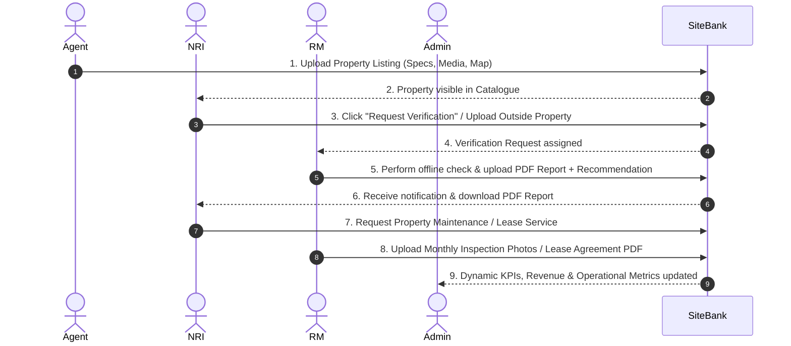

# SiteBank – NRI Property Management Platform
## Master Implementation Plan & System Architecture Specification

---

### Executive Summary

**SiteBank** is an exclusive operations and management platform built specifically for Non-Resident Indians (NRIs) who own property in India or plan to purchase property in India. 

The platform focuses on two core service offerings:
1. **Property Buying Assistance & Legal/Physical Verification**
2. **Property Maintenance & Lease Management**

SiteBank operates primarily as an operational tracking platform that seamlessly connects **NRIs**, **Relationship Managers (RMs)**, **Agents**, and **Admins** while maintaining offline execution integrity.

---

## 1. User Panels & Operational Scope

SiteBank contains four primary user panels, each tailored to specific operational responsibilities.

```
                               ┌────────────────────────────────┐
                               │  SiteBank Central Platform     │
                               └───────────────┬────────────────┘
                                               │
           ┌───────────────────┬───────────────┴───────────────┬───────────────────┐
           ▼                   ▼                               ▼                   ▼
    ┌──────────────┐    ┌──────────────┐                ┌──────────────┐    ┌──────────────┐
    │  Admin Panel │    │   NRI Panel  │                │   RM Panel   │    │  Agent Panel │
    └──────┬───────┘    └──────┬───────┘                └──────┬───────┘    └──────┬───────┘
           │                   │                               │                   │
     Read-Only           User Ops &                      Operations Desk      Listing &
     Analytics           Requests                        & Field Reports      Property Specs
```

---

### 1.1 Admin Panel (Executive Desk)
- **Purpose**: View overall business performance, revenue growth, active user statistics, and service request metrics.
- **Operational Constraint**: Admin does **not** participate in operational workflows or modify request states.
- **Key Features**:
  - High-level KPIs: Total NRIs, Total Agents, Total RMs, Total Properties.
  - Service Tracking: Active Verification Requests, Maintenance Requests, Lease Requests.
  - Revenue & Monthly Analytics: Monthly Recurring Revenue (MRR), commission fees, service volume distribution.
  - User & Activity Logs: Real-time operational audit log.

---

### 1.2 NRI Panel (Customer Portal)
- **Purpose**: Allows NRIs to discover properties, request physical verifications, upload outside properties, request home maintenance, and track lease revenue.
- **Dashboard**:
  - Summary cards: My Properties, Active Verifications, Ongoing Maintenances, Active Leases.
  - Activity Feed & Notifications Drawer.
- **Module 1 – Property Buying Assistance**:
  - **Property Catalog**: Search, filter by price, location, bedrooms, amenities, and property type (Apartment, Villa, Plot, Commercial).
  - **Property Details**: High-resolution image & video carousels, area specs (built-up sq. ft., plot area), amenities checklist, Google Maps link.
  - **Request Property Verification**: Submit one-click verification request for listed properties.
  - **Upload Outside Property**: Form to submit non-listed properties (Upload Title Deeds, DTCP Approval Plans, Photos, Address, Seller Contact, Notes).
  - **Verification Reports Hub**: Download offline verification reports (PDF format) with RM Recommendation badges (`Recommended` | `Recommended with Conditions` | `Not Recommended`).
- **Module 2 – Property Maintenance**:
  - Request maintenance services for owned properties.
  - **Monthly Inspections**: View photo/video inspection logs, comments, and monthly PDF reports.
  - **Emergency Inspections**: Receive instant updates on urgent issues, repair recommendations, and estimated costs.
- **Module 3 – Lease Management**:
  - Submit property for lease management (duration, target monthly rent, occupancy model: Serviced Apartment, Long-term, or Airbnb).
  - View signed agreement copy, track monthly rent payouts, and receive renewal reminders.
- **Reports & Notifications Hub**: Centralized repository for downloading all PDF reports.

---

### 1.3 Relationship Manager (RM) Panel (Operations Desk)
- **Purpose**: Coordinates all field operations, performs physical verification checks, uploads reports, and communicates with NRIs.
- **Dashboard**:
  - Assigned NRIs, Pending Verifications, Scheduled Inspections, Pending Lease Agreements.
- **Verification Workflow**:
  - Status progression: `Submitted` ➔ `Assigned` ➔ `Verification In Progress` ➔ `Report Uploaded` ➔ `Completed`.
  - Report Uploader: Upload verification report (PDF), site photos, detailed comments, and recommendation badge.
- **Maintenance Workflow**:
  - Status progression: `Requested` ➔ `Active` ➔ `Monthly Inspection Completed` ➔ `Issue Reported` ➔ `Completed`.
  - Monthly Inspection Desk: Upload monthly inspection photos, videos, comments, and PDF report.
  - Emergency Inspection Desk: Submit emergency issue alerts, damage photos, estimated repair cost, and repair recommendation.
- **Lease Workflow**:
  - Status progression: `Requested` ➔ `Agreement Pending` ➔ `Active` ➔ `Renewal Due` ➔ `Renewed` ➔ `Closed`.
  - Upload signed agreement copy, update occupancy model, and trigger lease renewals.
- **Customer Communication**: Direct messaging chat thread with assigned NRI clients.

---

### 1.4 Agent Panel (Listing Desk)
- **Purpose**: Helps agents list properties available for purchase on SiteBank.
- **Operational Constraint**: Agents cannot perform verifications and cannot contact customers after submission.
- **Dashboard**:
  - Uploaded Properties list, listing approval status, and read-only verification request counts.
- **Upload Property Form**:
  - Basic Specs: Title, Type (Apartment, Villa, Plot, Commercial), Price (INR ₹).
  - Address & Map: Full address, City, State, Pincode, Google Maps URL.
  - Structural Details: Plot Area (sq ft), Built-up Area (sq ft), Bedrooms, Bathrooms.
  - Visual Media: Image URLs, Video URLs.
  - Amenities Checklist: Gated security, 100% power backup, pool, EV charging, etc.
  - Owner Details: Full Name, Contact Number, Email.

---

## 2. Technical Stack & Architecture

| Layer | Technology | Usage |
| :--- | :--- | :--- |
| **Frontend Framework** | **Next.js 14+ (App Router)** | Modern React web framework with server & client components. |
| **Language** | **TypeScript** | Type-safe data models and robust props interfaces. |
| **Styling & UI** | **Tailwind CSS** | Custom glassmorphism components, luxury warm-slate & emerald palette. |
| **Icons & Motion** | **Lucide React & Framer Motion** | Micro-animations, interactive modals, workflow timelines. |
| **Data Visualization** | **Recharts** | Revenue growth charts, user analytics, request breakdowns for Admin. |
| **State Management** | **React Context API (`AppContext`)** | Reactive state engine with persistent `localStorage` synchronization. |
| **Role Switcher Header** | **Custom Header Toolbar** | Top-level role switcher for seamless testing between Admin, NRI, RM, and Agent. |

---

## 3. Comprehensive Data Models

```typescript
export type UserRole = 'admin' | 'nri' | 'rm' | 'agent';

export interface Property {
  id: string;
  title: string;
  type: 'Apartment' | 'Villa' | 'Plot' | 'Commercial';
  price: number;
  currency: string;
  address: string;
  city: string;
  state: string;
  pincode: string;
  googleMapUrl: string;
  description: string;
  images: string[];
  videos: string[];
  plotAreaSqFt: number;
  builtUpAreaSqFt: number;
  bedrooms: number;
  bathrooms: number;
  amenities: string[];
  ownerDetails: { name: string; contact: string; email: string };
  agentId: string;
  agentName: string;
  status: 'Draft' | 'Listed' | 'Verification In Progress' | 'Sold';
  createdAt: string;
}

export interface VerificationRequest {
  id: string;
  propertyId?: string;
  propertyTitle: string;
  propertyAddress: string;
  propertyImage?: string;
  isExternal: boolean;
  outsidePropertyDetails?: {
    id: string;
    title: string;
    nriId: string;
    address: string;
    city: string;
    sellerDetails: { name: string; contact: string; email: string };
    documents: { id: string; name: string; size: string; url: string; type: string }[];
    images: string[];
    notes: string;
  };
  nriId: string;
  nriName: string;
  nriEmail: string;
  assignedRmId: string;
  assignedRmName: string;
  status: 'Submitted' | 'Assigned' | 'Verification In Progress' | 'Report Uploaded' | 'Completed';
  recommendation?: 'Recommended' | 'Recommended with Conditions' | 'Not Recommended';
  verificationReportPdf?: string;
  rmImages?: string[];
  rmComments?: string;
  dateSubmitted: string;
  dateUpdated: string;
}

export interface MaintenanceRequest {
  id: string;
  propertyId: string;
  propertyTitle: string;
  propertyAddress: string;
  propertyImage: string;
  nriId: string;
  nriName: string;
  requirements: string;
  assignedRmId: string;
  assignedRmName: string;
  status: 'Requested' | 'Active' | 'Monthly Inspection Completed' | 'Issue Reported' | 'Completed';
  monthlyInspections: {
    id: string;
    month: string;
    date: string;
    photos: string[];
    videos: string[];
    reportPdf: string;
    comments: string;
  }[];
  emergencyInspections: {
    id: string;
    date: string;
    issueTitle: string;
    issueDetails: string;
    photos: string[];
    repairRecommendation: string;
    estimatedCost: number;
    status: 'Reported' | 'In Progress' | 'Resolved';
  }[];
  createdAt: string;
}

export interface LeaseRequest {
  id: string;
  propertyId: string;
  propertyTitle: string;
  propertyAddress: string;
  propertyImage: string;
  nriId: string;
  nriName: string;
  leaseDurationMonths: number;
  expectedMonthlyRent: number;
  specialConditions: string;
  occupancyType: 'Long Term Rental' | 'Serviced Apartment' | 'Airbnb / Short Term';
  assignedRmId: string;
  assignedRmName: string;
  agreementCopyPdf?: string;
  status: 'Requested' | 'Agreement Pending' | 'Active' | 'Renewal Due' | 'Renewed' | 'Closed';
  monthlyRentPayouts: { id: string; month: string; amount: number; status: 'Paid' | 'Pending'; payoutDate: string }[];
  createdAt: string;
}
```

---

## 4. End-to-End Operational Workflow Steps



---

## 5. Implementation Milestones

1. **Milestone 1**: Initialize Next.js project with TypeScript, Tailwind CSS, Lucide icons, and Recharts.
2. **Milestone 2**: Build `AppContext.tsx` state manager and `mockData.ts` with persistent storage.
3. **Milestone 3**: Build top navigation Header with instant Role Switcher and Notification drawer.
4. **Milestone 4**: Build Agent Property Upload Desk with amenities picker & specs inputs.
5. **Milestone 5**: Build NRI Portal featuring Property Buying, Verification Request, Outside Property Upload, Maintenance Hub, and Lease Tracking.
6. **Milestone 6**: Build RM Desk featuring Verification Report Uploader, Monthly/Emergency Inspection Uploader, and Lease Agreement Uploader.
7. **Milestone 7**: Build Admin Desk featuring KPI performance cards, revenue graphs, user analytics, and activity logs.
8. **Milestone 8**: Conduct end-to-end verification across all 4 roles.

---

## 6. Success Criteria

- [x] Agents can publish properties with complete specifications.
- [x] NRIs can browse properties and submit verification requests.
- [x] NRIs can submit outside properties (documents, photos, notes) for offline verification.
- [x] RMs can upload verification reports, photos, and set formal recommendations.
- [x] NRIs can request maintenance and receive monthly/emergency inspection updates.
- [x] Lease agreements and monthly rent payouts are tracked seamlessly.
- [x] Admin can monitor business performance and revenue analytics.
